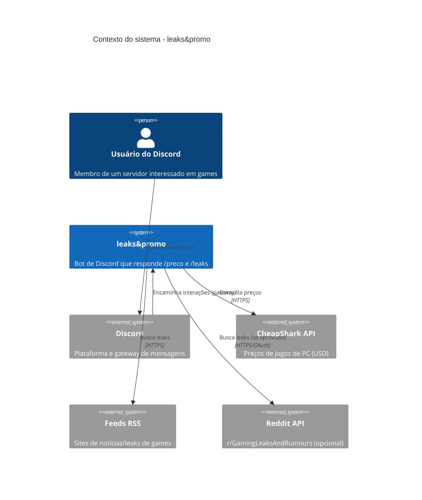
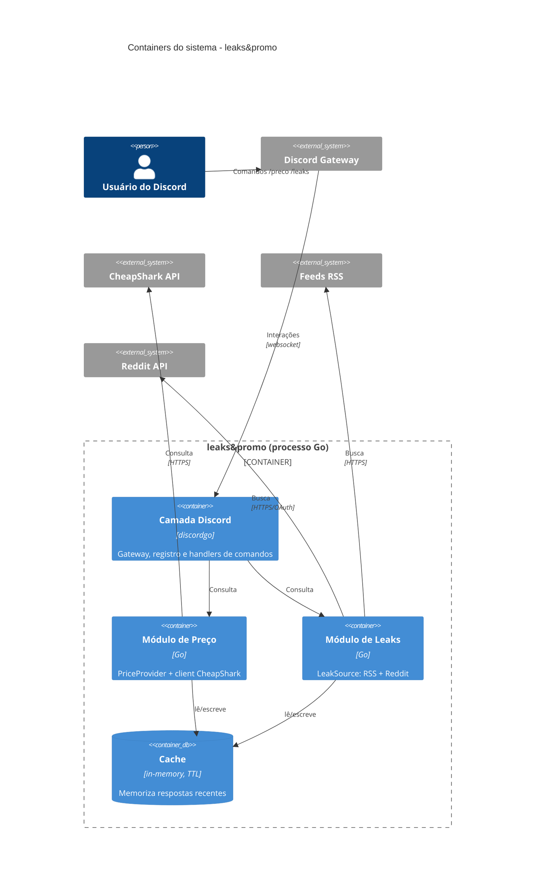
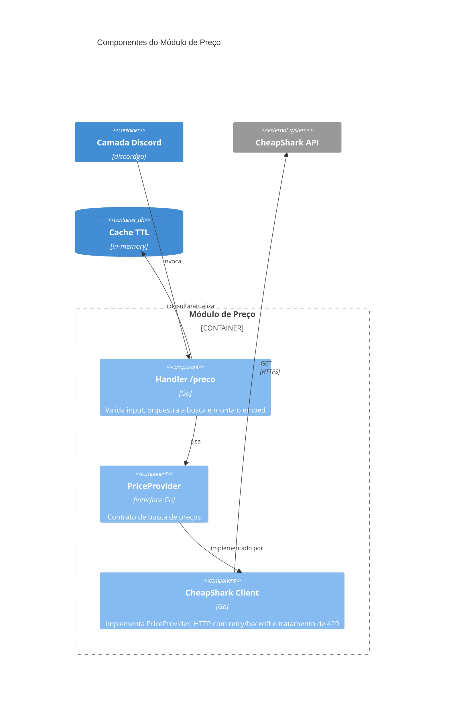

# Diagramas C4 — leaks&promo

Modelo [C4](https://c4model.com/) em Mermaid (renderiza nativamente no GitHub),
nos níveis **Contexto → Container → Componente**. Os diagramas refletem a
arquitetura pull-only e stateless da v1 (ver [ADRs](../adr/README.md)).

## Nível 1 — Contexto

## Nível 2 — Container

## Nível 3 — Componente (Módulo de Preço)

