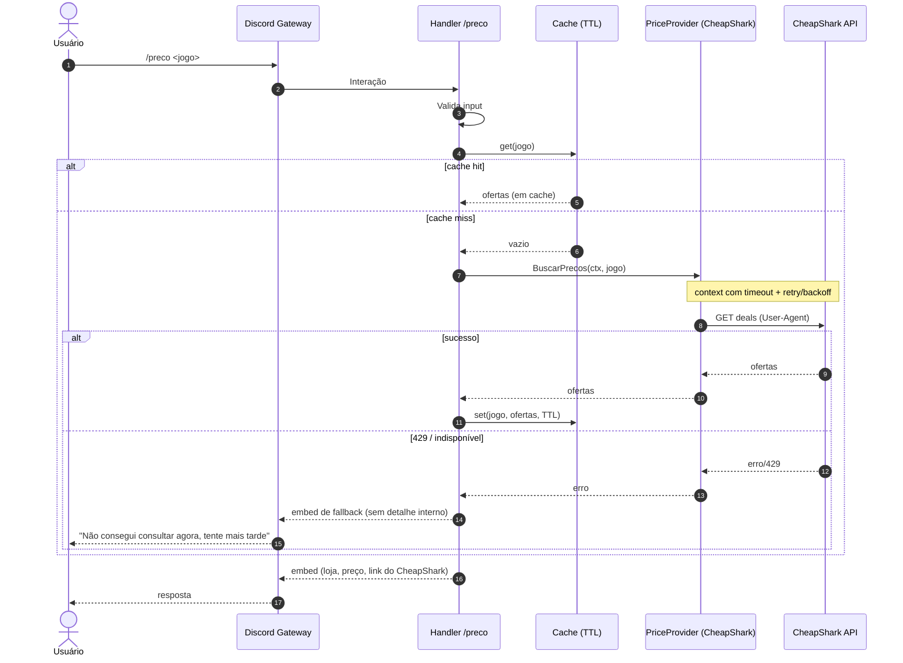
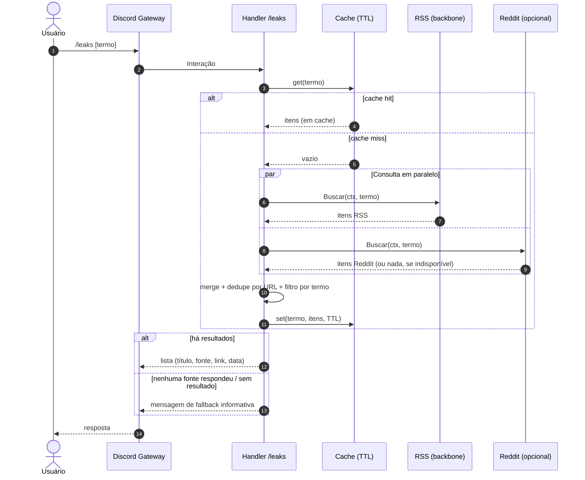

# Diagramas de Sequência — leaks&promo

Fluxo de um comando no modelo pull-only: **Discord → handler → cache → fonte →
resposta**, com cache (TTL) e mensagem de fallback em caso de falha.

## `/preco <jogo>`

## `/leaks [termo]`

> O RSS é o backbone: se o Reddit estiver indisponível ou não aprovado, o
> `/leaks` continua respondendo apenas com os itens do RSS.
